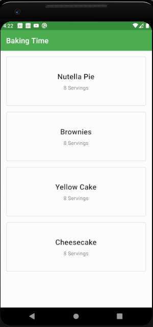
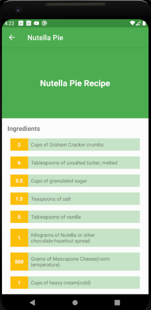
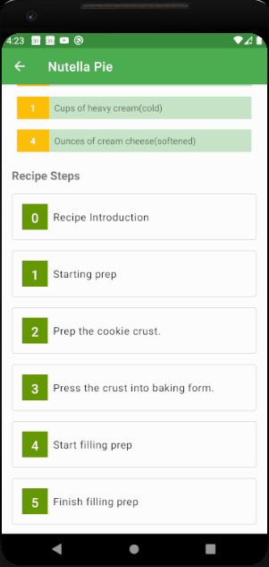
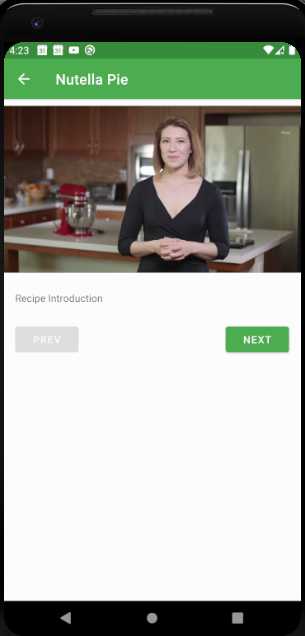
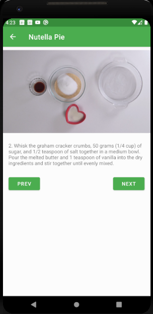
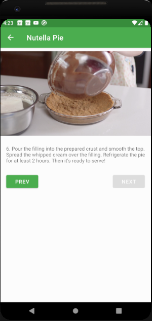
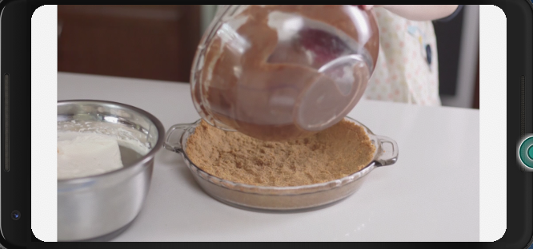
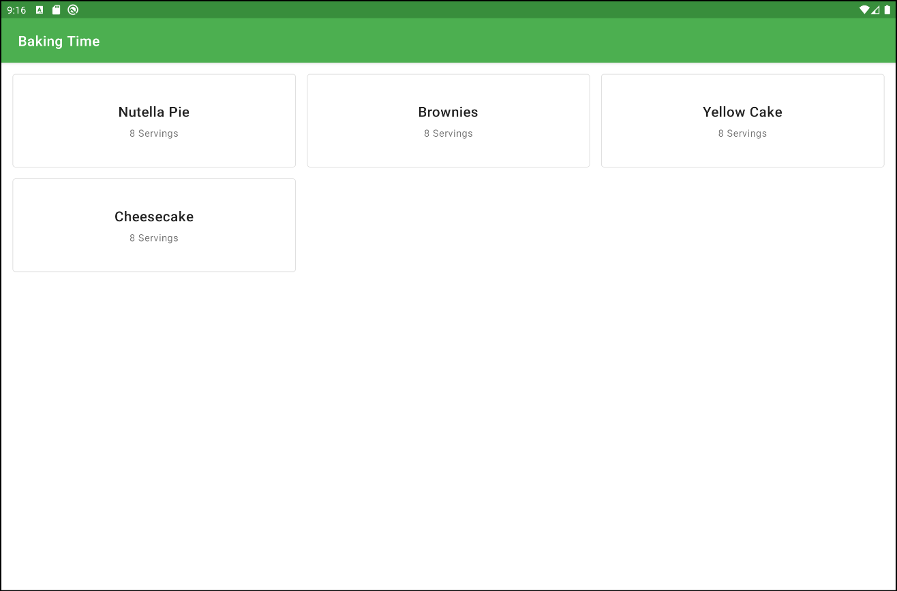
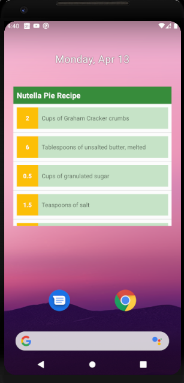

# BakingApp
A simple App that allows bakers to share their recipes.
Data for this App is hard codded in a JSON file found under `app/src/main/res/raw/bakingapp.json`

## Third party Libraries Used
1. Butterknife
1. GSON
1. ExoPlayer
1. MaterialCardView

## Architecture
Model View View Model (MVVM)
Single Activity, multiple fragments paradigm

## Screenshots
 
 

 
 

### Tablet Screens
 

### App Widget
